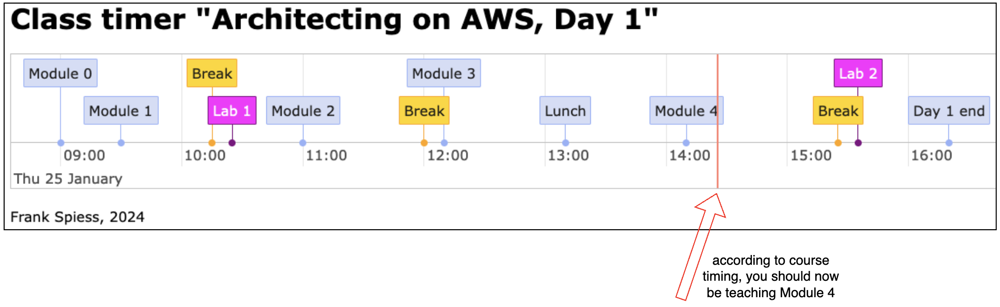

# AWS Class Timer

## Target audience:

* AWS trainers or those who are interested in becoming one

## Why shoud I bother?

* When delivering a new (AWS) training, it is always helpful to know which durations the different content items have.
* During the delivery, the view **dynamically** updates and tells you whether you are in time or not (see **red line** which is "now").
* The underlying HTML can be easily modified to cover other trainings, durations and content titles.
* You can intuitively drag the time line from left to right, and also zoom in and out
* Screenshot to get a better idea:
  

## How to use this solution?

* See a link of live example references: https://typex1.github.io/AWS-Class-Timer/
* Clone this github repo to your local machine
* Open one of the HTML files in your browser (JavaScript enabled)
* If your class starts at 10am instead of 9am, modify the HTML line which says "startTime = 9" (currently line #48)
* If you want to adjust to a different class, just modify titles and durations (in minutes) in the JS array "titles" starting from line #57.
* I will add HTML files for other classes soon!

## Project used

I used this great project for my solution: https://visjs.github.io/vis-timeline/examples/timeline/
